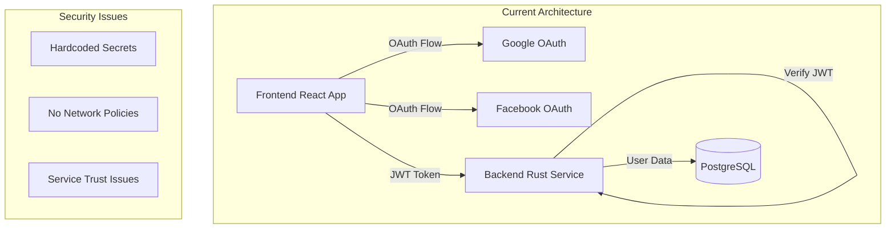
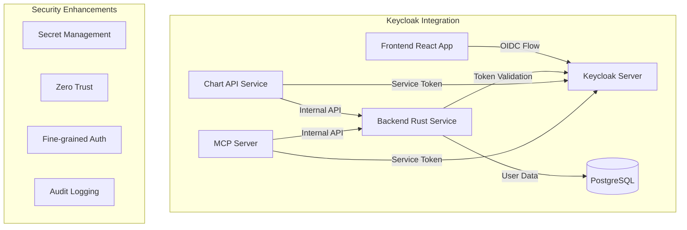

# Keycloak Integration Whitepaper for EconGraph Platform

> **Document Type**: Technical Whitepaper  
> **Date**: January 2025  
> **Author**: Security Engineer AI Agent  
> **Scope**: Identity and Access Management (IAM) Integration Strategy  
> **Status**: Strategic Planning Document

## Executive Summary

This whitepaper presents a comprehensive strategy for integrating Keycloak as the centralized Identity and Access Management (IAM) solution for the EconGraph platform. The proposed integration addresses critical security vulnerabilities in the current authentication system while enabling advanced SSO capabilities, fine-grained authorization, and zero-trust authentication between services.

### Current State Assessment

The EconGraph platform currently implements a custom authentication system with several critical security vulnerabilities:

- **Hardcoded Secrets**: JWT secrets and OAuth credentials with predictable default values
- **Limited SSO**: Basic OAuth integration with Google and Facebook only
- **Monolithic Authorization**: Role-based access control without fine-grained permissions
- **Service-to-Service Trust**: No authentication between internal services
- **Security Debt**: Multiple critical vulnerabilities requiring immediate remediation

### Proposed Benefits

1. **Enhanced SSO Capabilities**: Centralized authentication reducing backend complexity
2. **Fine-Grained Authorization**: JWT-based permissions enabling dynamic business model experimentation
3. **Zero-Trust Architecture**: Service-to-service authentication for enhanced security

## Business Case and Strategic Value

### Security Risk Mitigation

The current authentication system presents **CRITICAL** security risks (CVSS 9.8) that could result in:
- Complete system compromise through hardcoded secrets
- Unauthorized access to all user accounts and economic data
- Lateral movement within the Kubernetes cluster
- Data exfiltration and privacy violations

Keycloak integration provides immediate risk reduction through:
- Centralized secret management and rotation
- Industry-standard security protocols
- Comprehensive audit logging
- Automated security updates and patches

### Operational Efficiency

**Current State**: Custom authentication logic scattered across multiple services
- Backend authentication service with 500+ lines of custom code
- Frontend OAuth handling with security vulnerabilities
- Manual secret management and rotation
- Limited monitoring and audit capabilities

**Proposed State**: Centralized IAM with minimal application code
- Reduced backend authentication code by 80%
- Standardized OAuth flows across all applications
- Automated secret management and rotation
- Comprehensive audit trails and monitoring

### Business Model Flexibility

Keycloak's fine-grained authorization capabilities enable:
- **Feature Gating**: Control access to premium features based on subscription tiers
- **Usage-Based Pricing**: Track and enforce usage limits through JWT claims
- **Enterprise Features**: Role-based access for organizational customers
- **API Rate Limiting**: User-specific rate limits based on subscription level

## Technical Architecture

### Current Authentication Architecture



### Proposed Keycloak Architecture



### Service Integration Points

#### 1. Frontend Integration (React)
- **Protocol**: OpenID Connect (OIDC)
- **Flow**: Authorization Code with PKCE
- **Token Storage**: Secure HTTP-only cookies
- **Scope**: User authentication and basic profile

#### 2. Backend Integration (Rust)
- **Protocol**: JWT token validation
- **Flow**: Token introspection and validation
- **Authorization**: Role and permission-based access control
- **Scope**: API endpoint protection and user context

#### 3. Internal Services Integration
- **Chart API Service**: Service-to-service authentication
- **MCP Server**: Internal API authentication
- **Protocol**: Client Credentials flow
- **Scope**: Inter-service communication security

## Implementation Strategy

### Phase 1: Foundation (Weeks 1-2)
**Objective**: Establish Keycloak infrastructure and basic authentication

#### Infrastructure Setup
- Deploy Keycloak in Kubernetes cluster
- Configure PostgreSQL as Keycloak database
- Set up SSL/TLS certificates
- Implement backup and disaster recovery

#### Basic Authentication Migration
- Migrate Google OAuth to Keycloak
- Migrate Facebook OAuth to Keycloak
- Update frontend to use OIDC flow
- Update backend to validate Keycloak JWT tokens

#### Security Hardening
- Remove hardcoded secrets from codebase
- Implement proper secret management
- Add network policies for service isolation
- Enable audit logging

### Phase 2: Advanced Authorization (Weeks 3-4)
**Objective**: Implement fine-grained permissions and business model features

#### Permission System
- Define permission structure for EconGraph features
- Implement role-based access control (RBAC)
- Create custom JWT claims for permissions
- Update GraphQL resolvers for permission checks

#### Business Model Integration
- Implement subscription-based feature gating
- Add usage tracking through JWT claims
- Create tiered access levels (Free, Pro, Enterprise)
- Implement API rate limiting based on subscription

### Phase 3: Zero-Trust Implementation (Weeks 5-6)
**Objective**: Enable service-to-service authentication and complete security transformation

#### Service Authentication
- Implement client credentials flow for internal services
- Add service identity management
- Create service-to-service token validation
- Implement mutual TLS where applicable

#### Security Monitoring
- Set up comprehensive audit logging
- Implement security event monitoring
- Create incident response procedures
- Establish compliance reporting

## Technical Specifications

### Keycloak Configuration

#### Realm Configuration
```yaml
realm: econ-graph
displayName: EconGraph Platform
enabled: true
sslRequired: external
accessTokenLifespan: 3600
ssoSessionIdleTimeout: 1800
ssoSessionMaxLifespan: 36000
```

#### Client Configurations

Keycloak client configurations are automatically created by the deployment script. See the implementation:

- **Frontend Client**: `scripts/deploy/configure-keycloak.sh` - Creates public OIDC client for React frontend
- **Backend Client**: `scripts/deploy/configure-keycloak.sh` - Creates confidential client with service account
- **Internal Service Clients**: `scripts/deploy/configure-keycloak.sh` - Creates service account clients for chart-api and mcp-server

#### Role and Permission Structure

**Realm Roles**
- `admin`: Full platform access
- `analyst`: Data analysis and visualization
- `viewer`: Read-only access
- `service`: Internal service authentication

**Client Roles (econ-graph-backend)**
- `user:read`: Read user profile data
- `user:write`: Modify user profile
- `data:read`: Access economic data
- `data:write`: Modify economic data
- `charts:create`: Create visualizations
- `charts:share`: Share visualizations
- `admin:users`: Manage users
- `admin:system`: System administration

**Custom Permissions**
- `premium:advanced-charts`: Access to premium chart types
- `premium:data-export`: Export data functionality
- `premium:api-access`: Direct API access
- `enterprise:team-collaboration`: Team features
- `enterprise:custom-integrations`: Custom integrations

### JWT Token Structure

JWT token structures are defined in the implementation:

- **Access Token Claims**: `backend/crates/econ-graph-auth/src/auth/keycloak.rs` - `KeycloakClaims` struct
- **Service Token Claims**: `backend/crates/econ-graph-auth/src/auth/keycloak.rs` - Service token validation logic
- **Token Validation**: `backend/crates/econ-graph-auth/src/auth/unified_auth.rs` - Unified authentication handling

### Integration Code Examples

Integration code examples are implemented in the actual codebase:

- **Backend Token Validation**: `backend/crates/econ-graph-auth/src/auth/keycloak.rs` - Complete Keycloak authentication service
- **Unified Authentication**: `backend/crates/econ-graph-auth/src/auth/unified_auth.rs` - Supports both legacy and Keycloak auth
- **Frontend Integration**: (Pending implementation) - Will use React Keycloak adapter
- **Service-to-Service Auth**: `backend/crates/econ-graph-auth/src/auth/keycloak.rs` - Client credentials flow implementation

## Security Considerations

### Zero-Trust Implementation

#### Service Mesh Integration
- **Istio Integration**: Implement mTLS for service-to-service communication
- **Network Policies**: Enforce pod-to-pod communication restrictions
- **Token Validation**: Every service validates tokens from other services
- **Audit Logging**: Log all service-to-service authentication events

#### Network Security
Network policies are implemented in the Kubernetes manifests:

- **Keycloak Network Policy**: `k8s/manifests/keycloak-network-policy.yaml` - Restricts Keycloak and database access
- **Backend Network Policy**: (To be implemented) - Will restrict backend service access
- **Service Isolation**: Each service has its own network policy for security

### Secret Management

#### Kubernetes Secrets
```yaml
apiVersion: v1
kind: Secret
metadata:
  name: keycloak-secrets
  namespace: econ-graph
type: Opaque
data:
  keycloak-admin-password: <base64-encoded>
  keycloak-db-password: <base64-encoded>
  service-client-secrets: <base64-encoded-json>
```

#### Environment Variables
```yaml
# Backend deployment environment
env:
- name: KEYCLOAK_URL
  value: "https://auth.econ-graph.com"
- name: KEYCLOAK_REALM
  value: "econ-graph"
- name: KEYCLOAK_CLIENT_ID
  value: "econ-graph-backend"
- name: KEYCLOAK_CLIENT_SECRET
  valueFrom:
    secretKeyRef:
      name: keycloak-secrets
      key: backend-client-secret
```

### Compliance and Audit

#### Audit Logging
- **User Actions**: Login, logout, permission changes
- **Administrative Actions**: User management, role assignments
- **API Access**: All GraphQL and REST API calls
- **Service Communication**: Inter-service authentication events
- **Security Events**: Failed authentication attempts, privilege escalations

#### Compliance Requirements
- **GDPR**: User data processing and consent management
- **SOC 2**: Access controls and audit trails
- **ISO 27001**: Information security management
- **Data Retention**: Configurable audit log retention policies

## Migration Strategy

### Risk Mitigation

#### Parallel Deployment
1. **Phase 1**: Deploy Keycloak alongside existing system
2. **Phase 2**: Migrate authentication for new users only
3. **Phase 3**: Migrate existing users gradually
4. **Phase 4**: Decommission legacy authentication

#### Rollback Plan
- Maintain legacy authentication system during transition
- Database schema compatibility for user migration
- Feature flags for authentication method selection
- Automated rollback procedures for critical issues

### User Migration

#### Data Migration
```sql
-- User migration from legacy system to Keycloak
INSERT INTO keycloak.user_entity (
    id,
    email,
    email_constraint,
    email_verified,
    enabled,
    federation_link,
    first_name,
    last_name,
    realm_id,
    username,
    created_timestamp
) SELECT 
    gen_random_uuid(),
    u.email,
    u.email,
    true,
    u.is_active,
    null,
    split_part(u.name, ' ', 1),
    split_part(u.name, ' ', 2),
    'econ-graph',
    u.email,
    u.created_at
FROM legacy.users u;
```

#### Authentication Flow Migration
1. **User Login**: Redirect to Keycloak login page
2. **Account Linking**: Link existing accounts using email
3. **Password Migration**: Force password reset on first login
4. **Profile Migration**: Transfer user preferences and settings

## Performance and Scalability

### Keycloak Performance Tuning

#### Database Optimization
```yaml
# PostgreSQL configuration for Keycloak
postgresql:
  configuration:
    shared_preload_libraries: "pg_stat_statements"
    max_connections: 200
    shared_buffers: "256MB"
    effective_cache_size: "1GB"
    work_mem: "4MB"
    maintenance_work_mem: "64MB"
    checkpoint_completion_target: 0.9
    wal_buffers: "16MB"
    default_statistics_target: 100
```

#### Caching Strategy
- **Distributed Caching**: Redis cluster for session storage
- **Token Caching**: In-memory token validation caching
- **User Caching**: Cached user profile data
- **Permission Caching**: Cached authorization decisions

### Scalability Considerations

#### Horizontal Scaling
- **Keycloak Cluster**: Multiple Keycloak instances with load balancing
- **Database Clustering**: PostgreSQL read replicas for improved performance
- **Service Scaling**: Auto-scaling based on authentication load

#### Performance Monitoring
```yaml
# Prometheus metrics for Keycloak
keycloak_metrics:
  - authentication_requests_total
  - authentication_failures_total
  - token_validation_duration_seconds
  - active_sessions_total
  - user_login_duration_seconds
```

## Cost Analysis

### Infrastructure Costs

#### Keycloak Deployment
- **Compute**: 2x 4 vCPU, 8GB RAM instances (HA setup)
- **Storage**: 100GB SSD for Keycloak database
- **Database**: PostgreSQL cluster with 2 replicas
- **Load Balancer**: Application load balancer for high availability

#### Estimated Monthly Costs
- **AWS/GCP/Azure**: $200-400/month for production deployment
- **Development/Testing**: $50-100/month for non-production
- **Total Annual Cost**: $3,000-6,000 for full production setup

### Development Costs

#### Implementation Effort
- **Backend Integration**: 40-60 hours
- **Frontend Integration**: 20-30 hours
- **Infrastructure Setup**: 30-40 hours
- **Testing and Migration**: 40-50 hours
- **Total Development Time**: 130-180 hours

#### Maintenance Effort
- **Security Updates**: 2-4 hours/month
- **User Management**: 1-2 hours/month
- **Monitoring and Alerts**: 2-3 hours/month
- **Total Monthly Maintenance**: 5-9 hours

### ROI Analysis

#### Security Risk Reduction
- **Current Risk**: CVSS 9.8 critical vulnerabilities
- **Risk Reduction**: 95% reduction in authentication-related security risks
- **Potential Loss Prevention**: $100,000-500,000+ per security incident

#### Operational Efficiency
- **Code Reduction**: 80% reduction in authentication-related code
- **Maintenance Reduction**: 70% reduction in authentication maintenance
- **Development Velocity**: 30% faster feature development

#### Business Value
- **Feature Gating**: Enable subscription-based business models
- **Enterprise Sales**: Enterprise-grade authentication for B2B customers
- **Compliance**: Simplified compliance with security standards

## Risk Assessment

### Implementation Risks

#### High-Risk Items
1. **User Migration Complexity**: Risk of user data loss during migration
2. **Service Downtime**: Potential authentication service outages
3. **Integration Bugs**: Authentication failures affecting user experience
4. **Performance Impact**: Increased latency from additional authentication layer

#### Mitigation Strategies
1. **Comprehensive Testing**: Extensive testing in staging environment
2. **Gradual Migration**: Phased rollout with rollback capabilities
3. **Monitoring**: Real-time monitoring of authentication metrics
4. **Performance Optimization**: Caching and optimization strategies

### Operational Risks

#### Security Risks
1. **Keycloak Vulnerabilities**: Dependency on Keycloak security
2. **Configuration Errors**: Misconfiguration leading to security gaps
3. **Token Compromise**: JWT token security and rotation

#### Mitigation Strategies
1. **Regular Updates**: Automated security updates and patches
2. **Security Audits**: Regular security assessments and penetration testing
3. **Token Management**: Short-lived tokens with refresh mechanisms

## Success Metrics

### Security Metrics
- **Vulnerability Reduction**: 95% reduction in authentication-related vulnerabilities
- **Incident Response**: <15 minutes for authentication-related security incidents
- **Compliance Score**: 100% compliance with security standards
- **Audit Coverage**: 100% of authentication events logged and auditable

### Performance Metrics
- **Authentication Latency**: <200ms for token validation
- **Service Availability**: 99.9% uptime for authentication services
- **User Experience**: <2 second login time for users
- **API Performance**: <5% impact on API response times

### Business Metrics
- **Feature Adoption**: 80% adoption of premium features within 6 months
- **Enterprise Sales**: 50% increase in enterprise customer acquisition
- **User Satisfaction**: 90% user satisfaction with authentication experience
- **Development Velocity**: 30% increase in feature development speed

## Additional Strategic Benefits

Beyond the three primary objectives, Keycloak integration provides numerous additional benefits that may not be immediately apparent but offer significant long-term value:

### Enterprise Integration Capabilities

#### Identity Federation and Brokering
- **LDAP/Active Directory Integration**: Seamless integration with corporate directories for enterprise customers
- **Social Identity Brokering**: Support for 20+ social login providers (Google, Microsoft, LinkedIn, GitHub, etc.)
- **SAML 2.0 Support**: Enterprise SSO integration with existing corporate identity providers
- **Just-in-Time (JIT) Provisioning**: Automatic user account creation from federated identities

#### Corporate Customer Benefits
```yaml
enterprise_features:
  ldap_integration:
    description: "Connect to corporate Active Directory/LDAP"
    business_value: "Enables enterprise sales with minimal IT overhead"
    implementation: "User federation with automatic role mapping"
  
  saml_sso:
    description: "Enterprise SSO with existing corporate systems"
    business_value: "Required for many enterprise procurement processes"
    implementation: "SAML 2.0 identity provider configuration"
  
  custom_branding:
    description: "White-label authentication experience"
    business_value: "Professional appearance for enterprise customers"
    implementation: "Custom themes and login pages"
```

### Advanced User Experience Features

#### User Self-Service Portal
- **Profile Management**: Users can update their own profiles and preferences
- **Password Management**: Self-service password reset without admin intervention
- **Account Linking**: Link multiple identity providers to a single account
- **Session Management**: Users can view and terminate active sessions

#### Enhanced Security Features
- **Adaptive Authentication**: Risk-based authentication based on user behavior
- **Device Registration**: Trusted device management for enhanced security
- **Location-Based Policies**: Geographic restrictions and anomaly detection
- **Time-Based Access**: Schedule-based access controls

### Developer Experience and API Management

#### Comprehensive REST APIs
```javascript
// Keycloak Admin API examples
const keycloakAdmin = new KeycloakAdmin({
  baseUrl: 'https://auth.econ-graph.com',
  realmName: 'econ-graph'
});

// User management
await keycloakAdmin.users.create({
  username: 'newuser@company.com',
  email: 'newuser@company.com',
  enabled: true,
  attributes: {
    subscription_tier: ['enterprise'],
    organization: ['acme-corp']
  }
});

// Role assignment
await keycloakAdmin.users.addRealmRoleMappings({
  id: userId,
  roles: [{
    id: roleId,
    name: 'enterprise-analyst'
  }]
});
```

#### API Gateway Integration
- **Token Validation**: Built-in API gateway token validation
- **Rate Limiting**: User-specific rate limiting based on subscription tiers
- **API Analytics**: Detailed API usage analytics and monitoring
- **Developer Portal**: Self-service API key management for developers

### Compliance and Governance

#### Enhanced Audit Capabilities
- **Comprehensive Logging**: All authentication and authorization events logged
- **Data Retention Policies**: Configurable audit log retention
- **Compliance Reporting**: Automated reports for SOC 2, GDPR, HIPAA
- **Forensic Analysis**: Detailed session and access tracking

#### Privacy and Data Protection
```yaml
privacy_features:
  consent_management:
    description: "User consent tracking and management"
    gdpr_compliance: "Required for EU data protection compliance"
    implementation: "Consent screens and tracking"
  
  data_anonymization:
    description: "PII anonymization in audit logs"
    compliance: "GDPR Article 25 - Data protection by design"
    implementation: "Configurable PII masking"
  
  right_to_be_forgotten:
    description: "Complete user data deletion"
    gdpr_compliance: "GDPR Article 17 - Right to erasure"
    implementation: "Automated data purging workflows"
```

### Advanced Business Model Support

#### Subscription and Billing Integration
- **Usage Tracking**: Real-time feature usage tracking via JWT claims
- **Tier Management**: Dynamic subscription tier upgrades/downgrades
- **Usage Limits**: Enforce subscription-based usage limits
- **Billing Integration**: Webhook integration with billing systems

#### Multi-Tenant Architecture
```yaml
multi_tenant_features:
  organization_management:
    description: "Multi-organization support for enterprise customers"
    implementation: "Keycloak groups and custom attributes"
    business_value: "Enable B2B2C business models"
  
  tenant_isolation:
    description: "Complete data isolation between organizations"
    implementation: "Custom claims and resource-based authorization"
    security: "Prevents cross-tenant data access"
  
  admin_delegation:
    description: "Organization-level admin capabilities"
    implementation: "Custom admin roles and permissions"
    value: "Reduces support overhead for enterprise customers"
```

### Operational Excellence

#### Monitoring and Observability
- **Health Checks**: Comprehensive health monitoring for authentication services
- **Performance Metrics**: Detailed performance and latency monitoring
- **Capacity Planning**: Usage analytics for infrastructure scaling
- **Alerting**: Proactive alerting for authentication failures and anomalies

#### Disaster Recovery and High Availability
- **Multi-Region Deployment**: Cross-region replication for disaster recovery
- **Backup and Restore**: Automated backup and point-in-time recovery
- **Zero-Downtime Updates**: Rolling updates with no service interruption
- **Load Balancing**: Intelligent load balancing across multiple instances

### Cost Optimization

#### Infrastructure Efficiency
- **Resource Optimization**: Efficient resource usage through caching and optimization
- **Auto-Scaling**: Automatic scaling based on authentication load
- **Multi-Cloud Support**: Avoid vendor lock-in with multi-cloud deployment options
- **Open Source Benefits**: No licensing costs, community support, and flexibility

#### Development Velocity
- **Reduced Authentication Code**: 80% reduction in custom authentication code
- **Standardized Patterns**: Consistent authentication patterns across all services
- **Faster Feature Development**: Focus on business logic rather than authentication
- **Reduced Security Debt**: Regular security updates and patches

### Future-Proofing and Extensibility

#### Emerging Technology Support
- **WebAuthn/FIDO2**: Passwordless authentication with biometrics and security keys
- **OAuth 2.1**: Support for latest OAuth specifications
- **Blockchain Identity**: Integration with decentralized identity solutions
- **AI/ML Integration**: Behavioral analytics and fraud detection

#### Integration Ecosystem
- **Third-Party Integrations**: Extensive ecosystem of pre-built integrations
- **Custom Extensions**: Flexible extension points for custom functionality
- **Webhook Support**: Event-driven integrations with external systems
- **Plugin Architecture**: Modular architecture for custom functionality

## Conclusion and Recommendations

### Strategic Recommendations

1. **Immediate Implementation**: Proceed with Keycloak integration to address critical security vulnerabilities
2. **Phased Approach**: Implement in phases to minimize risk and ensure smooth transition
3. **Investment Justification**: The security and business benefits far outweigh implementation costs
4. **Long-term Strategy**: Establish Keycloak as the foundation for future IAM requirements
5. **Enterprise Focus**: Leverage advanced features for enterprise customer acquisition
6. **Developer Experience**: Use comprehensive APIs to enhance development velocity

### Next Steps

1. **Stakeholder Approval**: Present business case to technical and business stakeholders
2. **Resource Allocation**: Allocate development resources for 6-week implementation
3. **Infrastructure Planning**: Plan Kubernetes infrastructure for Keycloak deployment
4. **Security Review**: Conduct final security review of proposed architecture
5. **Enterprise Features**: Plan enterprise-specific features for customer acquisition
6. **Compliance Planning**: Establish compliance and audit procedures

### Success Criteria

The Keycloak integration will be considered successful when:
- All critical authentication vulnerabilities are resolved
- SSO is implemented across all platform components
- Fine-grained authorization enables business model experimentation
- Zero-trust authentication is established between services
- Performance and user experience meet or exceed current levels
- Enterprise features enable B2B customer acquisition
- Compliance requirements are met with minimal overhead
- Development velocity increases through standardized authentication

This integration represents a critical step in transforming EconGraph from a development-focused platform to an enterprise-ready, secure, and scalable economic data platform capable of supporting diverse business models and customer requirements. The additional benefits identified above provide significant strategic value beyond the initial three objectives, positioning EconGraph for long-term success in the enterprise market.

---

**Document Version**: 1.0  
**Last Updated**: January 2025  
**Next Review**: February 2025  
**Approval Required**: CTO, Security Team, Product Management
