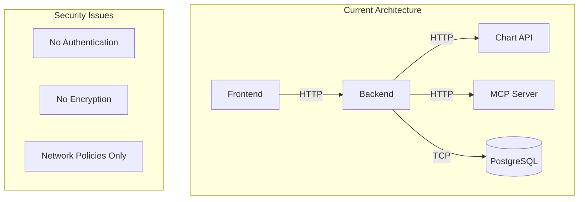
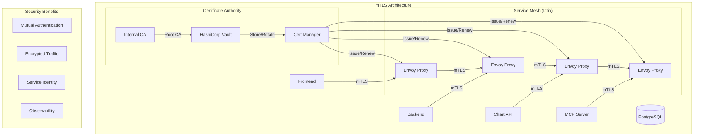

# Service-to-Service mTLS Authentication Whitepaper

> **Document Type**: Technical Whitepaper  
> **Date**: January 2025  
> **Author**: Security Engineer AI Agent  
> **Scope**: Mutual TLS Authentication for Internal Service Communication  
> **Status**: Strategic Planning Document

## Executive Summary

This whitepaper presents a comprehensive strategy for implementing mutual TLS (mTLS) authentication for service-to-service communication within the EconGraph platform. The proposed solution replaces JWT-based service authentication with cryptographic certificates, providing stronger security guarantees and eliminating the need for external certificate authorities.

### Current State Assessment

The EconGraph platform currently lacks service-to-service authentication:
- **No Inter-Service Auth**: Services communicate without authentication
- **Network Policies Only**: Security relies solely on Kubernetes network policies
- **JWT Token Approach**: Proposed JWT-based service authentication has limitations
- **External Dependencies**: Would require external certificate authorities

### Proposed Benefits

1. **Cryptographic Security**: Strong authentication using X.509 certificates
2. **Zero External Dependencies**: Internal certificate authority (CA)
3. **Automatic Certificate Management**: Automated issuance, renewal, and rotation
4. **Service Mesh Integration**: Istio-based mTLS with automatic enforcement
5. **Compliance Ready**: Meets enterprise security requirements

## Business Case and Strategic Value

### Security Risk Mitigation

**Current Risks**:
- Unauthenticated service-to-service communication
- Potential for lateral movement within the cluster
- Limited audit trail for inter-service requests
- Compliance gaps for enterprise customers

**mTLS Benefits**:
- **Cryptographic Authentication**: Every service connection is cryptographically verified
- **Automatic Encryption**: All inter-service traffic is encrypted in transit
- **Certificate-Based Identity**: Each service has a unique cryptographic identity
- **Audit Trail**: Complete visibility into service-to-service communication

### Operational Excellence

**Certificate Management**:
- **Automated Issuance**: Certificates created automatically for new services
- **Auto-Renewal**: Certificates renewed before expiration
- **Rotation Policies**: Configurable certificate rotation schedules
- **Revocation Support**: Immediate certificate revocation capabilities

**Service Mesh Integration**:
- **Transparent Implementation**: Applications don't need mTLS code
- **Automatic Enforcement**: All service communication automatically secured
- **Traffic Management**: Advanced routing and load balancing
- **Observability**: Detailed metrics and tracing

## Technical Architecture

### Current Service Communication



### Proposed mTLS Architecture



## Implementation Strategy

### Phase 1: Internal Certificate Authority (Week 1)
**Objective**: Establish internal CA infrastructure

#### Certificate Authority Setup
- Deploy HashiCorp Vault as internal CA
- Configure root and intermediate certificates
- Set up certificate issuance policies
- Implement certificate lifecycle management

#### Cert-Manager Integration
- Deploy cert-manager for Kubernetes
- Configure Vault integration
- Set up certificate issuers
- Test certificate issuance

### Phase 2: Service Mesh Implementation (Week 2)
**Objective**: Deploy Istio service mesh with mTLS

#### Istio Installation
- Deploy Istio control plane
- Configure Istio Gateway
- Set up Istio sidecar injection
- Configure mTLS policies

#### Service Integration
- Inject Istio sidecars into all services
- Configure service-to-service mTLS
- Set up traffic policies
- Test service communication

### Phase 3: Certificate Automation (Week 3)
**Objective**: Implement automated certificate management

#### Automated Issuance
- Configure cert-manager for automatic certificate creation
- Set up certificate renewal policies
- Implement certificate rotation
- Test certificate lifecycle

#### Monitoring and Alerting
- Set up certificate expiration monitoring
- Configure renewal failure alerts
- Implement certificate health checks
- Create operational dashboards

## Technical Specifications

### Internal Certificate Authority

#### HashiCorp Vault Configuration
The internal CA is implemented using HashiCorp Vault with PKI secrets engine:

- **Root CA**: Self-signed root certificate (10-year validity)
- **Intermediate CA**: Issued by root CA (5-year validity)
- **Service Certificates**: Issued by intermediate CA (30-day validity)
- **Certificate Policies**: Role-based certificate issuance

#### Certificate Hierarchy
```
EconGraph Root CA (10 years)
├── EconGraph Intermediate CA (5 years)
    ├── Frontend Service Cert (30 days)
    ├── Backend Service Cert (30 days)
    ├── Chart API Service Cert (30 days)
    ├── MCP Server Cert (30 days)
    └── Keycloak Service Cert (30 days)
```

### Service Mesh Configuration

#### Istio mTLS Policies
Service-to-service communication is secured through Istio PeerAuthentication and DestinationRule resources:

- **Strict mTLS**: All service communication requires mTLS
- **Automatic Certificate Injection**: Istio automatically manages certificates
- **Certificate Rotation**: Automatic certificate renewal without service restart
- **Traffic Encryption**: All traffic encrypted in transit

#### Service Identity
Each service receives a unique identity based on:
- **Service Account**: Kubernetes service account
- **Namespace**: Service namespace
- **Service Name**: Kubernetes service name
- **Certificate Subject**: X.509 certificate subject

### Certificate Management

#### Automated Lifecycle
Certificates are managed automatically through cert-manager:

- **Issuance**: New certificates created when services start
- **Renewal**: Certificates renewed 7 days before expiration
- **Rotation**: Automatic certificate rotation without downtime
- **Revocation**: Immediate revocation capability for compromised certificates

#### Security Policies
- **Certificate Validity**: 30-day validity for service certificates
- **Key Size**: RSA 2048-bit or ECDSA P-256 keys
- **Signature Algorithm**: SHA-256 with RSA or ECDSA
- **Subject Alternative Names**: Include service DNS names

## Security Considerations

### Certificate Security

#### Private Key Protection
- **Hardware Security Modules**: Optional HSM integration for root CA
- **Key Encryption**: Private keys encrypted at rest
- **Access Control**: Role-based access to certificate operations
- **Audit Logging**: Complete audit trail of certificate operations

#### Certificate Validation
- **CRL Support**: Certificate Revocation List support
- **OCSP Stapling**: Online Certificate Status Protocol
- **Certificate Pinning**: Service-specific certificate validation
- **Trust Chain Validation**: Complete certificate chain verification

### Network Security

#### Service Mesh Security
- **mTLS Enforcement**: All service communication requires mTLS
- **Traffic Policies**: Fine-grained traffic control
- **Security Policies**: Network and authentication policies
- **Observability**: Complete visibility into service communication

#### Zero-Trust Implementation
- **Default Deny**: All communication denied by default
- **Explicit Allow**: Only explicitly allowed communication permitted
- **Identity Verification**: Every request verified against service identity
- **Continuous Monitoring**: Real-time monitoring of service communication

## Implementation Details

### HashiCorp Vault Deployment

#### Vault Configuration
Vault is deployed with PKI secrets engine for certificate management:

- **High Availability**: Vault cluster with multiple replicas
- **Storage Backend**: Consul or etcd for HA storage
- **Unsealing**: Automated unsealing with AWS KMS or similar
- **Access Control**: Role-based access control (RBAC)

#### PKI Secrets Engine
```
vault secrets enable -path=econ-graph-pki pki
vault secrets tune -max-lease-ttl=87600h econ-graph-pki
```

### Cert-Manager Integration

#### Vault Issuer Configuration
Cert-manager is configured to use Vault as certificate issuer:

- **Vault Connection**: Secure connection to Vault API
- **Certificate Issuer**: Vault PKI role for certificate issuance
- **Renewal Policy**: Automatic renewal before expiration
- **Error Handling**: Retry logic for failed operations

#### Certificate Resources
```yaml
apiVersion: cert-manager.io/v1
kind: Certificate
metadata:
  name: backend-service-cert
  namespace: econ-graph
spec:
  secretName: backend-service-tls
  issuerRef:
    name: vault-issuer
    kind: ClusterIssuer
  dnsNames:
  - backend-service.econ-graph.svc.cluster.local
  - backend.econ-graph.svc.cluster.local
```

### Istio Service Mesh

#### Control Plane Installation
Istio control plane is deployed with mTLS enabled:

- **Istiod**: Control plane component
- **Istio Gateway**: Ingress gateway configuration
- **Sidecar Injection**: Automatic sidecar injection
- **Configuration**: mTLS policies and traffic rules

#### mTLS Policy Configuration
```yaml
apiVersion: security.istio.io/v1beta1
kind: PeerAuthentication
metadata:
  name: default
  namespace: econ-graph
spec:
  mtls:
    mode: STRICT
```

## Migration Strategy

### Gradual Rollout

#### Phase 1: Non-Critical Services
- Deploy mTLS for non-critical services first
- Test certificate management and renewal
- Validate service communication
- Monitor performance impact

#### Phase 2: Critical Services
- Deploy mTLS for backend and database services
- Test end-to-end service communication
- Validate certificate rotation
- Monitor security improvements

#### Phase 3: Full Deployment
- Deploy mTLS for all services
- Remove legacy authentication mechanisms
- Implement comprehensive monitoring
- Document operational procedures

### Rollback Plan

#### Emergency Procedures
- **Certificate Issues**: Automatic fallback to service mesh bypass
- **Performance Problems**: Gradual rollback of mTLS enforcement
- **Service Failures**: Individual service certificate renewal
- **CA Issues**: Emergency certificate issuance procedures

## Performance Considerations

### Overhead Analysis

#### Certificate Validation
- **CPU Overhead**: ~5-10% increase in CPU usage
- **Memory Overhead**: ~50-100MB per service for certificates
- **Network Overhead**: ~100-200 bytes per request
- **Latency Impact**: ~1-2ms additional latency per request

#### Optimization Strategies
- **Certificate Caching**: Cache validated certificates
- **Connection Pooling**: Reuse TLS connections
- **Hardware Acceleration**: Use hardware TLS acceleration
- **Certificate Compression**: Optimize certificate sizes

### Scalability Considerations

#### Certificate Volume
- **Service Scaling**: Automatic certificate issuance for new replicas
- **Certificate Storage**: Efficient storage of certificate secrets
- **Renewal Load**: Distributed certificate renewal
- **CA Performance**: CA scaling for high certificate volume

## Monitoring and Observability

### Certificate Monitoring

#### Health Checks
- **Certificate Expiration**: Monitor certificate expiration dates
- **Renewal Status**: Track certificate renewal success/failure
- **Validation Errors**: Monitor certificate validation failures
- **CA Health**: Monitor CA availability and performance

#### Alerting
- **Expiration Alerts**: Alert 7 days before certificate expiration
- **Renewal Failures**: Immediate alerts for renewal failures
- **Validation Errors**: Alerts for certificate validation issues
- **CA Issues**: Alerts for CA unavailability

### Service Communication Monitoring

#### Istio Observability
- **Service Mesh Metrics**: Detailed service communication metrics
- **Certificate Metrics**: Certificate usage and validation metrics
- **Traffic Analysis**: Service-to-service traffic patterns
- **Security Events**: mTLS authentication events

#### Grafana Dashboards
- **Certificate Dashboard**: Certificate lifecycle and health
- **Service Mesh Dashboard**: Service communication overview
- **Security Dashboard**: mTLS enforcement and violations
- **Performance Dashboard**: mTLS performance impact

## Cost Analysis

### Infrastructure Costs

#### HashiCorp Vault
- **Compute**: 3x 2 vCPU, 4GB RAM instances (HA cluster)
- **Storage**: 100GB SSD for Vault data
- **Licensing**: Vault Enterprise for production features
- **Estimated Cost**: $300-500/month

#### Istio Service Mesh
- **Control Plane**: 2x 1 vCPU, 2GB RAM instances
- **Sidecar Proxies**: ~50MB RAM per service pod
- **No Additional Cost**: Open source Istio
- **Estimated Cost**: $100-200/month

### Operational Costs

#### Certificate Management
- **Automation**: Minimal manual intervention required
- **Monitoring**: Standard monitoring infrastructure
- **Maintenance**: Quarterly CA certificate renewal
- **Support**: Standard DevOps support

## Risk Assessment

### Implementation Risks

#### Technical Risks
1. **Certificate Complexity**: Complex certificate management
2. **Performance Impact**: Potential performance degradation
3. **Service Disruption**: Risk of service communication failures
4. **CA Failure**: Risk of certificate authority unavailability

#### Mitigation Strategies
1. **Gradual Rollout**: Phased implementation with testing
2. **Performance Testing**: Comprehensive performance validation
3. **Rollback Procedures**: Well-defined rollback processes
4. **High Availability**: HA CA deployment with backup procedures

### Operational Risks

#### Certificate Management
1. **Expiration Issues**: Risk of certificate expiration
2. **Renewal Failures**: Risk of automatic renewal failures
3. **Key Compromise**: Risk of private key compromise
4. **CA Compromise**: Risk of CA private key compromise

#### Mitigation Strategies
1. **Automated Monitoring**: Comprehensive expiration monitoring
2. **Multiple Renewal Mechanisms**: Backup renewal procedures
3. **Key Rotation**: Regular key rotation policies
4. **CA Security**: Strong CA security practices

## Success Metrics

### Security Metrics
- **mTLS Enforcement**: 100% of service communication uses mTLS
- **Certificate Coverage**: 100% of services have valid certificates
- **Zero Unauthenticated Traffic**: No unauthenticated service communication
- **Certificate Rotation**: 100% successful certificate rotations

### Performance Metrics
- **Latency Impact**: <5ms additional latency per request
- **CPU Overhead**: <10% increase in CPU usage
- **Memory Overhead**: <100MB per service
- **Availability**: 99.9% service availability during certificate operations

### Operational Metrics
- **Certificate Automation**: 100% automated certificate management
- **Renewal Success**: 100% successful certificate renewals
- **Alert Response**: <15 minutes for certificate alerts
- **Operational Overhead**: <1 hour/week for certificate management

## Conclusion and Recommendations

### Strategic Recommendations

1. **Immediate Implementation**: Proceed with mTLS implementation to enhance security
2. **Phased Approach**: Implement in phases to minimize risk
3. **Service Mesh First**: Deploy Istio service mesh before custom mTLS
4. **Internal CA**: Use internal CA to eliminate external dependencies

### Next Steps

1. **Stakeholder Approval**: Present business case to technical and business stakeholders
2. **Resource Allocation**: Allocate development resources for 3-week implementation
3. **Infrastructure Planning**: Plan Vault and Istio infrastructure deployment
4. **Security Review**: Conduct final security review of proposed architecture

### Success Criteria

The mTLS implementation will be considered successful when:
- All service-to-service communication uses mTLS
- Internal certificate authority is operational
- Automated certificate management is working
- Performance impact is within acceptable limits
- Security posture is significantly improved

This implementation represents a critical step in transforming EconGraph from a development-focused platform to an enterprise-ready, secure, and compliant economic data platform capable of meeting the highest security standards.

---

**Document Version**: 1.0  
**Last Updated**: January 2025  
**Next Review**: February 2025  
**Approval Required**: CTO, Security Team, DevOps Team
